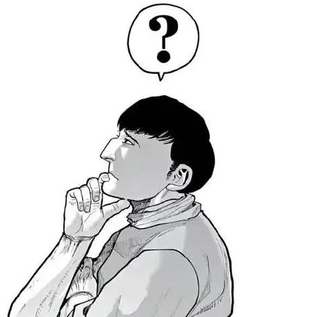

<div align="center">

# Hi, I'm Zhenyu Yang (杨振宇) 👋

### Teaching video AI to watch, remember, reason — and respond on time.

[](https://sotayang.github.io/)
[](https://scholar.google.com/citations?user=tsrUbzsAAAAJ)
[](https://orcid.org/0009-0005-5298-0543)
[](mailto:yangzhenyu2022@ia.ac.cn)


</div>



- 🎓 Fourth-year Ph.D. student (2022–2027) at **CASIA**
- 🔭 Building **streaming video understanding** systems and multimodal agents
- ⚡ Interested in models that know **when to act** and **how to remember**
- 🏆 SIGIR 2024 Best Paper Honorable Mention · ICLR 2025 Spotlight
- 🤝 Always happy to discuss research and collaboration

> Offline video models watch the replay. I want AI to understand the live stream.

<br clear="right"/>

## ⭐ Star constellation

<!-- These badges update automatically. No manual star counting required. -->

| Project | What it does | Stars |
| :-- | :-- | :--: |
| [**Awesome Streaming Video Understanding**](https://github.com/sotayang/Awesome-Streaming-Video-Understanding) | Papers, code, and datasets for always-on, real-time video AI | [](https://github.com/sotayang/Awesome-Streaming-Video-Understanding/stargazers) |
| [**LiveStar**](https://github.com/sotayang/LiveStar) | A live streaming assistant for real-world online video understanding | [](https://github.com/sotayang/LiveStar/stargazers) |
| [**SVBench**](https://github.com/sotayang/SVBench) | Temporal multi-turn benchmark for streaming video understanding | [](https://github.com/sotayang/SVBench/stargazers) |
| [**LDRE**](https://github.com/sotayang/LDRE) | LLM-based divergent reasoning for composed image retrieval | [](https://github.com/sotayang/LDRE/stargazers) |

## 📡 Current transmission

```text
camera stream ──► temporal memory ──► multimodal reasoning ──► act at the right moment
                         ▲                                      │
                         └──────────── learn from feedback ──────┘
```

- **Streaming perception:** understand an unbounded video as it arrives
- **Proactive interaction:** decide whether and when a response is needed
- **Efficient memory:** preserve useful history without replaying everything
- **Multimodal reasoning:** connect visual events, language, and long-term context

<details>
<summary><b>📊 Open the lab dashboard</b></summary>
<br/>

<div align="center">
  <a href="https://github.com/sotayang">
    
  </a>
  <a href="https://github.com/sotayang">
    
  </a>
</div>

<div align="center">
  
</div>

<div align="center">
  &nbsp;
  &nbsp;
  &nbsp;
  &nbsp;
  &nbsp;
  &nbsp;
  &nbsp;
  &nbsp;
  
</div>

</details>

<details>
<summary><b>🐍 Release the contribution snake</b></summary>
<br/>

<picture>
  <source media="(prefers-color-scheme: dark)" srcset="https://raw.githubusercontent.com/sotayang/sotayang/output/github-contribution-grid-snake-dark.svg">
  <source media="(prefers-color-scheme: light)" srcset="https://raw.githubusercontent.com/sotayang/sotayang/output/github-contribution-grid-snake.svg">
  
</picture>

</details>

---

<div align="center">
  <sub>Research should not only understand what happened — it should be ready for what happens next.</sub>
</div>
